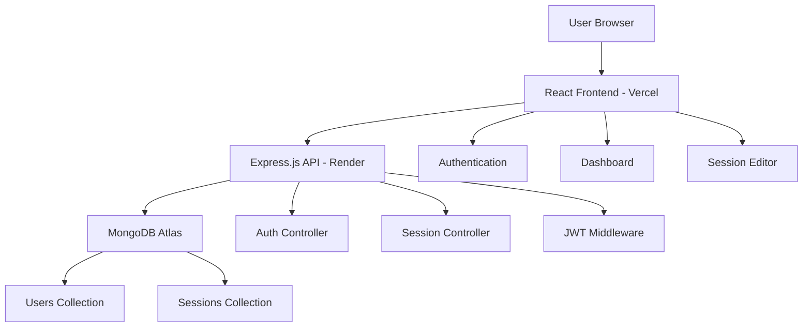

Here's a **well-organized and comprehensive README** for your Arvyax Wellness platform:

# 🧘♀️ Arvyax Wellness Platform


 -  [📖 API Docs](#-api-reference) -  [🚀 Quick Start](#-quick-start)


***

## 📋 Table of Contents

- [🌟 Overview](#-overview)
- [✨ Key Features](#-key-features)
- [🛠️ Tech Stack](#️-tech-stack)
- [🏗️ Architecture](#️-architecture)
- [🚀 Quick Start](#-quick-start)
- [📁 Project Structure](#-project-structure)
- [🔧 Configuration](#-configuration)
- [📚 API Reference](#-api-reference)
- [🎨 UI Components](#-ui-components)
- [🔒 Security](#-security)
- [📱 Responsive Design](#-responsive-design)
- [🚀 Deployment](#-deployment)
- [📊 Performance](#-performance)
- [🧪 Testing](#-testing)
- [🤝 Contributing](#-contributing)
- [📄 License](#-license)

***

## 🌟 Overview

Arvyax Wellness is a comprehensive platform designed to help users create, manage, and share wellness sessions. Built with modern web technologies, it features a professional UI/UX design, secure authentication, and advanced session management capabilities.

### 🌐 Live Links
- **Frontend**: [https://arvyax-asssign.vercel.app/](https://arvyax-asssign.vercel.app/)
- **Backend API**: [https://arvyax-backend-jqxh.onrender.com](https://arvyax-backend-jqxh.onrender.com)

***

## ✨ Key Features

### 🔐 **Authentication System**
- ✅ Professional login/signup with JWT authentication
- ✅ Password strength validation and visibility toggles  
- ✅ Secure token management and protected routes
- ✅ Glassmorphism UI with wellness-inspired design

### 📊 **Professional Dashboard**
- ✅ Dual-view: Personal sessions & Community sessions
- ✅ Advanced search and filtering capabilities
- ✅ Real-time statistics and progress tracking
- ✅ Responsive grid layout with status indicators

### ✏️ **Advanced Session Editor**
- ✅ Smart autosave (5-second delay after changes)
- ✅ Tag suggestion system for better discovery
- ✅ Draft/publish workflow management
- ✅ Real-time save status indicators
- ✅ Mobile-optimized interface

### 🎨 **Premium UI/UX**
- ✅ Modern glassmorphism effects and smooth animations
- ✅ Wellness-focused color palette and typography
- ✅ Professional button styling with hover effects
- ✅ Fully responsive design for all devices
- ✅ Accessible focus states and keyboard navigation

***

## 🛠️ Tech Stack


Frontend
Backend
Database
Deployment


- React 18
- React Router DOM
- Axios
- React Toastify
- CSS3 (Custom)
- Responsive Design


- Node.js
- Express.js
- JWT Authentication
- bcryptjs
- CORS
- Middleware


- MongoDB
- Mongoose ODM
- Atlas Cloud
- Data Modeling


- Vercel (Frontend)
- Render (Backend)
- Environment Variables
- Auto Deployment


***

## 🏗️ Architecture



***

## 🚀 Quick Start

### Prerequisites
```bash
Node.js >= 14.x
MongoDB (Atlas account recommended)
Git
```

### 1️⃣ Clone Repository
```bash
git clone https://github.com/your-username/arvyax-wellness.git
cd arvyax-wellness
```

### 2️⃣ Backend Setup
```bash
cd backend
npm install

# Create environment file
cat > .env 
JWT_SECRET=
PORT=5000
NODE_ENV=production
```

### Database Setup (MongoDB Atlas)
1. Create MongoDB Atlas account
2. Create new cluster
3. Configure network access (0.0.0.0/0 for production)
4. Create database user with readWrite permissions
5. Get connection string for MONGODB_URI

***

## 📊 Performance

### Optimization Techniques
- ✅ **Code Splitting**: Dynamic imports for route components
- ✅ **Image Optimization**: Compressed wellness imagery
- ✅ **CSS Optimization**: Minimized custom CSS bundle
- ✅ **API Optimization**: Efficient MongoDB queries with indexing
- ✅ **Caching**: Browser caching for static assets

### Performance Metrics
| Metric | Target | Current |
|--------|---------|---------|
| **First Contentful Paint** | 

### 👨💻 **Project Maintainer**

**[Your Name]**

[
- 💡 [Request Feature](https://github.com/your-repo/issues/new?template=feature_request.md)
- 📖 [Documentation](https://github.com/your-repo/wiki)
- 💬 [Discussions](https://github.com/your-repo/discussions)

***

## 🙏 Acknowledgments

- 🎨 **UI Inspiration**: Modern SaaS platforms and wellness apps
- 📷 **Imagery**: [Unsplash](https://unsplash.com) for beautiful wellness photography
- 🛠️ **Tools**: Create React App, Express Generator, MongoDB Atlas
- 👥 **Community**: Open source contributors and beta testers
- 📚 **Resources**: MDN Web Docs, React Documentation, Node.js Guides

***


### 🌟 **Star this repository if you found it helpful!**

**Made with ❤️ for the wellness community**

*Empowering mindfulness through modern technology*

![Wellness](https://img.shields.io/badge/Wellness-First-green](https://img.shields.io/badge/Community-Driven-purple
